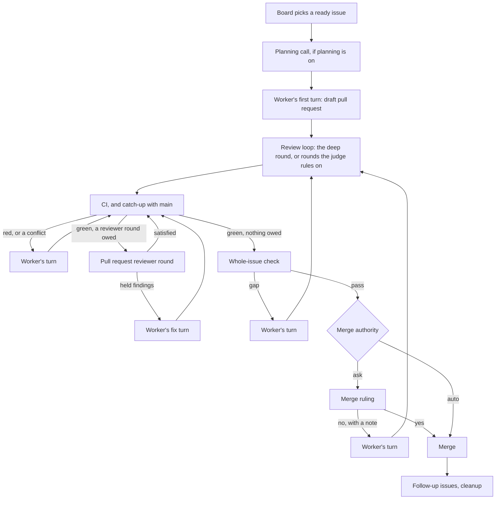

# How kelpie works

This is one issue's path through kelpie, from the `ready-for-agent` label to a merged pull request: which agents kelpie runs, when it calls each one, and how the review loop decides a pull request is ready for CI. It uses the words in [`CONTEXT.md`](../CONTEXT.md). The README's [Reference](../README.md#reference) has every setting, and [`design-log.md`](design-log.md) says why each choice was made.

Most of kelpie is plain code. Each project has one runner, which plays the project manager: it keeps the board, the gates and the pacing, asks kelpie's dog for each lease, and calls a model only for the work and for judgement. A runner does one thing per step, such as a turn, a round, a verdict or a summon. Steps run back to back while there is work, and about once a minute while everything waits.

## The lifecycle

1. The board picks an issue. A free slot (`max_items`) takes an adopted pull request first, then a pull request asking for a rework, then `ready-for-agent` issues by `priority: P0` to `P3` label, and the lowest number first. It passes over an issue that is assigned, blocked by an open issue, closed by an open pull request, split into sub-issues, finished before, or carrying a `worker:` label it cannot read. The pacer checks first ([Budgets](#budgets-and-ceilings)). `shep kelpie add <issue>` skips the board, planning and the daily allowance.
2. Planning, only with `planning.enabled` on (off by default). One call decides whether the issue is one pull request or several, and may pick the worker. Several become sub-issues, which the board works in the issue's place. Under `ask` a split waits on a ruling.
3. A work item opens. Kelpie names its branch `kelpie/<issue>`, cut from `origin/main` into a worktree of its own with a build folder, and puts `in-progress` on the issue.
4. The worker's first turn. A fresh session implements the issue, pushes, and opens a draft pull request.
5. The review loop. On a new project, one deep round: two readers, a failing test for each HIGH, one fix turn and a re-check that runs the tests. A project can list the older loop of local reviewers instead, whose findings the judge rules on.
6. CI. A branch behind `main` is caught up first. A red run, or a conflict with `main`, is the worker's next turn.
7. Pull request reviewer rounds, with `coderabbit.enabled` on: CodeRabbit, cubic or Codex reviews, and the judge rules on its threads.
8. The whole-issue check. A fresh session checks the final diff against every acceptance criterion, and sends the worker back on a gap.
9. The merge. Under `ask` the maintainer gets the merge ruling, and under `auto` kelpie merges and sends a notice. Either way it is a merge commit of the head the gates passed.
10. The end. Deferred findings become follow-up issues, and the worktree, branches and build folder go.

## Who does what

Models are the ones `shep kelpie add` writes, or the code's default for a key that may be left out. A role's agent in the project's `[agents]` table wins over its `models` entry, so any role but the relay can run on Claude Code, Codex or pi ([Agents](../README.md#agents)).

| Role | Triggered by | Runs on | Sees | Produces |
| --- | --- | --- | --- | --- |
| Project manager (the runner) | Every step | Kelpie's own code | The board, the forge, git, the state file | Work items, summons, rebases, merges, rulings |
| Planning call | The board picks an issue, with `planning.enabled` on | `models.planner` or `agents.planner`: Opus 5.5, medium | The issue's title and body, and a detached worktree at `origin/main` to read | JSON: whole or split, the pieces and what blocks each, an optional worker pick |
| Worker | Each turn kelpie sends it | `models.worker` or `agents.worker`: Sonnet 5.5, high, unless a `worker:<model>-<effort>` label names another | Its worktree and build folder, inside its sandbox | Commits, pushes, the draft pull request, or a `<kelpie-question>` |
| Crew | None today | | | |
| Command or endpoint reviewer | Its turn in `review.reviewers` | A script, or kelpie's own reviewer on an OpenAI-compatible server, from `[kelpie.local_reviewers]` | The diff from the round's base, and the issue's acceptance criteria | Findings as `SEVERITY\|path:line\|what\|why` |
| Claude round (`claude`) | Its turn in the loop, or no other reviewer can run | `models.reviewer` or `agents.reviewer`: Sonnet 5, medium | The diff, the criteria, the worktree through Read, Grep and Glob, and shots | Findings, or exactly `CLEAN` |
| `kind = "claude"` or `"session"` reviewer | Its turn in the loop | Its own model and effort, or the agent it names | As the Claude round | As the Claude round |
| Deep round readers, two | `deep`'s turn in the loop | `models.deep_reviewer` or `agents.deep_reviewer`: Opus 5.5, high | The diff, the criteria, the worktree through Read, Grep and Glob, and shots. The second also sees what the first found | Findings, or exactly `CLEAN`. The second reports only what the first missed |
| Deep round confirming session | Each HIGH the readers found | The `deep_reviewer` role | The finding, and the worktree, where it may run commands under the worker's fence | A failing test left in the worktree, or the finding marked unconfirmed |
| Deep round re-check | The worker's fix turn pushed | The `deep_reviewer` role | The findings, and only the diff since they were sent. It runs each failing test | Each finding fixed, with evidence, or unfixed |
| Judge | Each finding of a loop round (not the deep round's), and each open thread of a pull request reviewer | `models.judge` or `agents.judge`: Opus 5.5, low | One finding and the diff, with no tools but Read on a screenshot the finding names | One line of JSON: whether it holds, and its severity |
| Fix turns | Held findings, red CI, a conflict, a gap, a ruling's `no` | The worker, resuming its session | A prompt, and a findings file in its build folder | A push |
| Pull request reviewers | Kelpie's summon after green CI | CodeRabbit, cubic or Codex on their own service, within windows `[kelpie.reviewers]` sets | The pull request on GitHub | A review with threads |
| CI | The repo's own workflows | The repo's runners | The branch | Green or red checks |
| Whole-issue check | Green CI with no reviewer round owed | `models.auditor` or `agents.auditor`: Opus 5.5, high | The issue and what it points to, the pull request's text, the final diff, the worktree | JSON: each criterion met or not, each assumption checked or not |
| Merge gate | Every gate passed | Kelpie's own code | The head, its CI, `main` | A merge commit, or a withdrawn yes |
| Relay | A ruling or notice, where `ruling_channels` has `relay` | `models.relay`: Haiku 4.5, low | The question | A push to the maintainer's phone, and the answer |
| The maintainer | A ruling | | The question, on the webhook or the relay | `yes`, `no <note>`, or an answer |

Every agent call but the relay's runs inside kelpie's sandbox, and only the worker commits and pushes. The planning call, the Claude, session and deep round readers, and the whole-issue check may read the worktree, but run no command and start no subagent. The deep round's confirming session may run commands and write tests into the worktree, and its re-check may run commands but write only the build folder. There is no crew today: the worker's instructions say to implement the issue inline and hand nothing to subagents, and the rules kelpie wraps around every skill say to spawn none.

## The review loop

The loop runs between the worker's draft pull request and CI. It starts again from its first round after the fix for a whole-issue check gap, a ruling's `no`, an accepted head pushed outside kelpie, or a rework's first turn, since each is new code. Settings: [The review loop](../README.md#the-review-loop).

A project lists its reviewers in `review.reviewers`. Each round goes down the list from the reviewer after the last round's, to the first that can run. One cannot run when its `paths` match no changed file, when `review.local_rounds` are spent (command and endpoint reviewers only), or when it is down. Two names are always defined: `deep`, the project's deep round, and `claude`, its own Claude round, which also runs whenever no listed reviewer can. A project that lists none runs the qwen-review script and then the deep round, and `add` writes `reviewers = ["deep"]` where the script is not installed. One that sets the older `review.local` runs that round and then `claude`.

### The deep round

The deep round runs once, when its turn comes, and the loop ends with it. Every session in it is a fresh one on the `deep_reviewer` role, paced on that role's account.

1. Two readers. The first reads the diff from the round's base, with the issue's acceptance criteria, for defects: a trigger and an effect a failing test could be written from, not style or naming. It may read the worktree and runs no command. The second gets the same prompt and the first's findings, and reports only what the first missed. If neither finds anything, the loop ends.
2. Confirmation. For each HIGH, a session that may run commands in the worktree writes a failing test and answers `CONFIRMED|<test file>|<command>`, or `UNCONFIRMED|<why>`. It can write only the worktree and the build folder, so it commits and pushes nothing. A HIGH it cannot back with a test still goes to the worker, marked unconfirmed, and whatever that session left in the worktree is put back.
3. One fix turn. Every finding from both readers goes into `review-findings.md`, with each HIGH's test left uncommitted in the worktree for the worker to make pass and commit. There is no judge in the deep round. A finding out of scope can go into `deferred-findings.md`, and the worker then takes its test out.
4. The re-check. Once the fix is pushed, with nothing left uncommitted and each confirming session's test lines still in place, a session that may run commands but writes only the build folder reads the diff since the findings were sent, runs each failing test, and answers `FIXED` or `UNFIXED` for each finding. A finding it leaves out, or calls fixed with no evidence, is unfixed. With nothing unfixed the loop ends. Unfixed findings go back to the worker once and are re-checked once more, and still unfixed after that raise `deep-review`, whose yes sends them to the worker again.

A fix turn that pushed nothing, left files uncommitted, or changed a confirming session's test raises `fix-not-pushed`. A worker that deferred every finding has nothing to push and goes straight to CI.

### The loop of rounds

With other reviewers listed before `deep`, or instead of it, the loop runs rounds.

A round sees the diff from its base, which is `origin/main` or the head an adopted pull request arrived with, and the issue's acceptance criteria. A Claude or session round runs the `code-review` skill, may read the worktree, and gets shots of the head when the preview is on and the head changes a file under the preview's folder.

A round with no findings is clean at once. Otherwise the judge takes the findings one at a time, each in a fresh call, and answers whether each holds and at what severity, regrading either way. The worker never sees a rejected finding.

The held findings go into `review-findings.md` in the build folder, at the judge's severity, and the worker's next turn fixes them and pushes. A finding out of scope can go into `deferred-findings.md` instead. A fix turn counts only if the branch's head on `origin` moved: one that pushed nothing raises `fix-not-pushed`.

A round is clean when the judge held nothing above `LOW`. The loop ends on a clean round whose previous round was also clean and by a different reviewer, or on a clean round by the only reviewer that could run. A clean round's held nits still go to the worker, and when that round ends the loop, the fix goes on to CI with no further round.

A command reviewer can mark a file `not reviewed`. Until a later command or endpoint round leaves none unreviewed, or none of them can run, no round counts as clean. A round with nothing but such lines reviewed nothing: it is neither clean nor counted, and runs once more. A second in a row marks that reviewer down for the rest of the work item.

Past `review.loop_guard` rounds (8 as `add` writes it) the worker parks on `review-guard`, and a yes lets this pass go on. A later pass counts from round one again. `review.local_rounds` caps the command and endpoint rounds per work item, across every pass, and after that only the other reviewers run.

## After the loop

### CI and `main`

While a work item waits on CI, a label, ready state or head that kelpie did not set raises `foreign-change`, and a branch changing agents' own files (such as `.claude`, `.codex` or `.mcp.json`) raises `claude-files`. A branch behind `main` is rebased and pushed by kelpie, or merged when adopted. A conflict is the worker's next turn: it merges `origin/main` in and never force-pushes. The same conflict again, or any after three conflict turns, raises `rebase`. Kelpie trusts a check set once it has had two minutes to register. A red run is the worker's next turn, through the `diagnosing-bugs` skill, and a second red run on a head the worker left alone raises `still-red`. A push after red CI or a conflict goes straight back to CI, not through the review loop, though with pull request reviewers on it owes a new round while rounds are left.

### Pull request reviewer rounds

`coderabbit.enabled` switches CodeRabbit, cubic and Codex alike. On green CI, while a round is owed, kelpie marks the draft ready, asks the dog for a lease on each listed reviewer's window, and summons the first granted in `pull_request_reviewers` order. Only kelpie summons, by the `review please` label or a comment such as `@codex review`, and it sends a summon once more after fifteen silent minutes. Once a review covers the head, the judge rules on every open thread from every listed reviewer, against the diff from `main`. Rejected threads are resolved. Held ones, whatever their severity, are the worker's fix turn, and the push goes back to CI. A round is satisfied when no thread is open and nothing is held. Kelpie's own clean catch-up with `main` owes no new round.

The cap is `coderabbit.rounds` when set, or else the changed lines outside `generated`, divided by `coderabbit.divisor` and rounded up, plus one. At the divisor's cap with findings held the worker parks on `coderabbit-cap`, and a yes sends the findings and lifts the cap. With a fixed `rounds`, the last round's findings go to the worker and its fix summons nothing more. Settings: [Settings](../README.md#settings).

### The whole-issue check

On green CI with no reviewer round owed, a fresh session on the `auditor` role reads two files in the build folder's `audit` folder. `issue.md` holds the issue, every issue or pull request its body names as `#<n>`, and the pull request's title and body. `diff.patch` holds the final diff against `origin/main`. The session runs nothing, and answers in JSON whether each acceptance criterion is met and where, and whether each assumption about the world outside the repo is checked against the real thing. A gap is the worker's next turn, and the fix goes through the review loop, CI and the check again. After two such trips the next gap raises `audit`, and a yes sends the gaps once more. A head it passed is checked again only if the issue, what it points to, or the pull request's text changes. Details: [Merging](../README.md#merging).

### The merge

With the preview on and a head that changes a file under the preview's folder, kelpie first takes shots and posts them on the pull request, and a failed run holds nothing. Under `ask`, kelpie labels the pull request `ready-for-human` and raises the merge ruling. A yes merges with `gh pr merge --merge --match-head-commit`, and only while the head is the one asked about, CI on it is green and the branch has the latest `main`. Otherwise the yes is withdrawn, CI runs again and the ruling comes again. Under `auto` kelpie takes the same path with no ruling: a first refusal goes back to CI, a second raises `merge-refused`, and after the merge a notice goes to the webhook, or to the relay where the webhook is off. With a merge queue on `main` the merge only queues the pull request, and a removal from the queue is the worker's next turn, like red CI.

### After the merge

Each finding the worker moved to `deferred-findings.md`, if kelpie had sent it, becomes a `ready-for-agent` issue in kelpie's words: at once under `auto`, after a `follow-up` ruling under `ask`. Then kelpie removes the worktree, both branches, the build folder and the shots branch, and records the issue as finished so the board never takes it again. A pull request the maintainer merges by hand ends the same way.

## When something goes wrong

### Budgets and ceilings

| What runs out | Setting | What happens |
| --- | --- | --- |
| The 5-hour window | `pacing.enabled` | At 50%, no work item, worker turn, Claude, session or deep round session, or whole-issue check starts until it resets. A running turn finishes. |
| Today's share of the week | `pacing.enabled` | No work item opens, adoptions and reworks included. Open ones carry on. |
| Usage that cannot be read | | The pacer holds both, ten minutes at a time, and `status` says why. |
| A turn's time | `worker.turn_timeout`, 60 minutes | Kelpie stops the turn, keeps its session and raises `turn-timeout`. |
| Review rounds | `review.loop_guard` | `review-guard` |
| Command and endpoint rounds | `review.local_rounds` | Only the other reviewers run after. |
| Deep round re-checks | Two | `deep-review` |
| Pull request reviewer rounds | `coderabbit.rounds` or `coderabbit.divisor` | Findings held at the divisor's cap raise `coderabbit-cap`. |
| Whole-issue check trips | Two | `audit` |
| Conflict turns | Three | `rebase` |

A new work item waits on every account its roles spend, the deep round's only where the project runs it. The judge and the planning call are not paced call by call: a round's verdicts never wait between them, and the planning call runs only once that check has passed. Command and endpoint rounds spend no account. Accounts and agents: [Agents](../README.md#agents).

### Rulings

A ruling is a decision only the maintainer makes, and a work item waiting on one is parked and keeps its slot. Each goes to the channels in `ruling_channels`, the webhook, the relay or both, and as a comment on its pull request, if it has one, except the merge ruling. `shep kelpie rule <id> yes`, `no <note>` or an answer settles it, from the terminal, the relay or an ntfy reply ([Answer a ruling](../README.md#8-answer-a-ruling)). Unless the table says otherwise, a `no` sends the note as the worker's next turn, and that fix goes through the review loop again.

| Ruling | Raised when | Yes |
| --- | --- | --- |
| `merge` | Every gate passed under `ask` | Merges the head asked about |
| `question` | The worker ended a turn on a `<kelpie-question>` block | Takes an answer, not a yes or no: it is the worker's next turn |
| `split` | Planning would split the issue, under `ask` | Opens the sub-issues. A `no` works the issue whole, and an answer plans again with it. |
| `turn-timeout` | A turn ran past `worker.turn_timeout` | Resumes the session. A `no` stops the work item. |
| `turn-failed` | A turn could not run or its call failed, or a first turn stopped short twice | Retries. A `no` stops the work item. |
| `claude-files` | The branch changes agents' own files | Accepts them at this head. A `no` stops the work item. |
| `fix-not-pushed` | A fix turn pushed nothing, or, in the deep round, left files uncommitted or changed a confirming test | Sends the same findings again |
| `deep-review` | The deep round's second re-check still finds findings unfixed | Sends them to the worker once more |
| `review-guard` | The loop passed `review.loop_guard` | Lets this pass go on |
| `local-model-spilled` | The local model sat partly on the CPU | Runs the round again |
| `still-red` | CI failed again on a head the worker left alone | Back to CI, once the maintainer has fixed the branch |
| `rebase` | Kelpie could not rebase, or a conflict came back | Back to CI, once the maintainer has fixed the branch |
| `coderabbit-cap` | Reviewer rounds hit the cap with findings held | Sends the findings, lifts the cap |
| `coderabbit-silent` | A summoned reviewer posted nothing in two hours | Back to CI, then a new summon |
| `audit` | The whole-issue check found gaps after two trips | Sends the gaps once more |
| `merge-refused` | An `auto` merge was refused twice, or the merge queue removed it twice at one head | Back to CI |
| `foreign-change` | A label, ready state or head changed outside kelpie | Accepts it, and a new head goes through the review loop |
| `closed` | Someone closed the pull request unmerged | Drops the work item |
| `follow-up` | A merged pull request left deferred findings, under `ask` | Files them. A `no` drops them. |
| `split-stuck`, `close-stuck` | The forge refused a split step, or a parent's close, three times in a row | Tries again. A `no` works the issue whole, or leaves it open. |

A work item that ends unmerged, by a `no` that stops it or by `shep kelpie drop`, keeps its pull request, labelled `ready-for-human`.

### Calls and reviewers that fail

- The planning call that times out or fails is tried once more in a fresh session. A second failure, or a reply that is not a plan, works the issue whole.
- A worker turn whose worktree cannot be prepared or whose call errors raises `turn-failed`. A first turn that ends with no pull request and no question is sent back once, and a turn that left files uncommitted and pushed nothing is sent back once to commit them.
- A command or endpoint reviewer that is missing or does not answer stops the runner at start. A command that reviews nothing twice in a row, as the qwen-review script does when it cannot reach its model, is down for the work item: `status` lists it under `local_reviewers_down`, and the others carry the loop.
- A round, a verdict, a deep round reader or re-check, or the whole-issue check that fails outright, or whose answer cannot be read, is tried again at the next step, with no count kept. A Claude round or a reader must answer findings or exactly `CLEAN`, and the whole-issue check must list a criterion when the issue has some. A deep round confirming session that fails leaves its HIGH unconfirmed instead, and the round goes on.
- A pull request reviewer that refuses a summon is parked until its window opens, and the round goes to the next listed one with a free window. One silent for two hours raises `coderabbit-silent`.
- The forge or git failing a read or a push is logged, and the step runs again next time.
